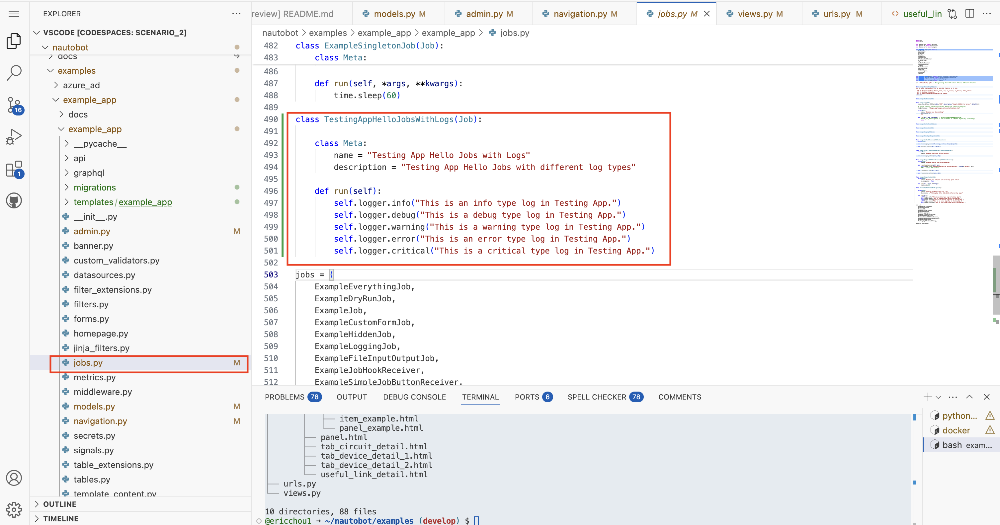
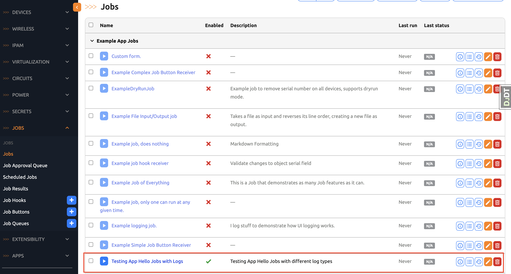
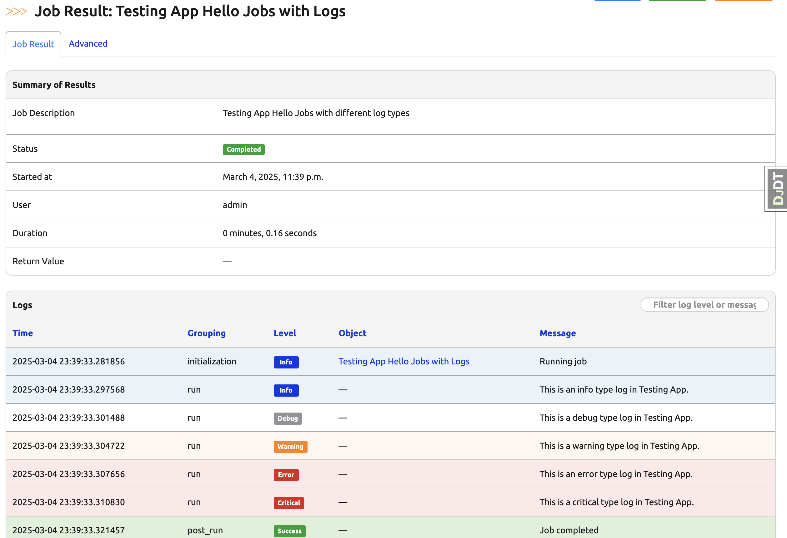

# Example App Creating New Job

Nautobot Jobs are the work horses of the Nautobot ecosystem. They can be standalone, as we have been constructing for the first two segments of this challenge, or they can be bundled into Nautobot apps. 

In today's challenge, we will put a small, 'hello world' type of job in the example_app we have been working on, just to how we can include jobs in Nautobot Apps. 

## Job Code

It seems so long ago we knew nothing about Nautobot Jobs, but if we went back to memory lane in the first few jobs we constructed, we wrote a simple job that logs some outputs: 

```python jobs.py
class TestingAppHelloJobsWithLogs(Job):

    class Meta:
        name = "Testing App Hello Jobs with Logs"
        description = "Testing App Hello Jobs with different log types"

    def run(self):
        self.logger.info("This is an info type log in Testing App.")
        self.logger.debug("This is a debug type log in Testing App.")
        self.logger.warning("This is a warning type log in Testing App.")
        self.logger.error("This is an error type log in Testing App.")
        self.logger.critical("This is a critical type log in Testing App.")
...
jobs = (
    ...
    TestingAppHelloJobsWithLogs,
)
```

Let us find the `jobs.py` file in the `example_app` directory and add the code to the end of the file, don't forget to register the new job in the `jobs` list: 



Here is the full `jobs.py` file: 

```python jobs.py
import sys
import time

from django.conf import settings
from django.db import transaction
from django.forms import widgets

from nautobot.apps.jobs import (
    BooleanVar,
    ChoiceVar,
    DryRunVar,
    FileVar,
    IntegerVar,
    IPAddressVar,
    IPAddressWithMaskVar,
    IPNetworkVar,
    Job,
    JobButtonReceiver,
    JobHookReceiver,
    JSONVar,
    MultiChoiceVar,
    MultiObjectVar,
    ObjectVar,
    register_jobs,
    StringVar,
    TextVar,
)
from nautobot.dcim.models import Device, Location, LocationType
from nautobot.extras.choices import ObjectChangeActionChoices
from nautobot.extras.jobs import get_task_logger
from nautobot.extras.models import Status

name = "Example App jobs"  # The "grouping" that will contain all Jobs defined in this file.


class ExampleEverythingJob(Job):
    """An example Job that uses and documents as much Job functionality as possible."""

    class Meta:
        """Metaclass attributes, describing and configuring this Job."""

        name = "Example Job of Everything"
        description = """\
This is a Job that demonstrates as many Job features as it can.

- All of the magic methods (before_start, run, on_success, on_failure, after_return).
- All of the Meta attributes.
- All of the ScriptVariable types as Job inputs.
- Etc."""
        approval_required = True  # Default: False
        # Set to True to make it so that another user must approve any run of this Job
        # before it can be executed.
        dryrun_default = False  # Default: False
        # Set to True to default Job execution to "dry-run" mode.
        # Exactly what that means is up to the Job implementation.
        field_order = []  # Default: unspecified (empty list)
        # The order the input variables appear in the UI.
        # If unspecified, they appear in declaration order.
        has_sensitive_variables = False  # Default: True
        # Set to False to assert that this Job's variables are non-sensitive;
        # that is, they are permissible to save to the database and be made visible to
        # any user who can view this Job's results.
        hidden = False  # Default: False
        # Set to True for a Job that's not shown in the UI by default.
        read_only = False  # Default: False
        # Set to True to assert that this Job does not make any changes to Nautobot data or the
        # broader environment; exactly what this means is up to the job implementation.
        soft_time_limit = 1000  # Default: None (follow global configuration)
        # Time in seconds before Celery will automatically attempt to gracefully end the Job
        # by raising a SoftTimeLimitExceeded exception.
        task_queues = []  # Default: []
        # The list of task queue names this Job wants to be routable to.
        # Typically you'll configure this in the database, not hard-code it into the Job itself.
        template_name = ""  # Default: ""
        # App-only feature at present as only Apps can provide additional Django template files.
        # Relative path of a Django template to display this Job's inputs in the UI for execution.
        time_limit = 2000  # Default: None (follow global configuration)
        # Time in seconds before Celery will automatically attempt terminate the Job by killing the
        # Celery worker process.
        is_singleton = False  # Default: False
        # A Boolean that if set to `True` prevents the job from running twice simultaneously.
        # Any duplicate job instances will error out with a singleton-specific error message.

    # Definition of input variables requested when running this Job
    should_fail = BooleanVar(description="Check this box to force this Job to fail")
    string_input = StringVar(
        # Common optional parameters to all ScriptVariable types:
        default="Hello World!",
        description="Say hello to somebody...",
        label="Brief String Input",
        required=True,  # default is True for all input variables unless specified otherwise
        widget=widgets.TextInput,  # default widget for StringVar
        # Additional optional parameters specific to StringVar
        min_length=5,  # minimum number of characters
        max_length=255,  # maximum number of characters
        regex=r"^Hello .*!$",  # regex that any provided value must match
    )
    text_input = TextVar(
        default="Lorem ipsum...",
        description="You could type a whole essay here.",
        label="Longer Text Input",
        required=True,
    )
    integer_input = IntegerVar(
        default=0,
        min_value=-100,
        max_value=100,
    )
    choice_input = ChoiceVar(
        description="Select a single value from the given choices",
        choices=(
            ("#ff0000", "Red"),  # value, display string
            ("#00ff00", "Green"),
            ("#0000ff", "Blue"),
        ),
    )
    multiple_choice_input = MultiChoiceVar(
        description="Select any number of values from the given choices",
        choices=(
            ("#ff0000", "Red"),  # value, display string
            ("#00ff00", "Green"),
            ("#0000ff", "Blue"),
        ),
        required=False,
    )
    location_type_input = ObjectVar(
        description="Select a single object instance",
        model=LocationType,
    )
    object_input = ObjectVar(
        description="Select a single object instance from an API endpoint filtered by the previous selection",
        model=Location,
        display_field="name",
        query_params={"location_type": "$location_type_input"},
        null_option="(none)",
        required=False,
    )
    multiple_object_input = MultiObjectVar(
        description="Select any number of object instances",
        model=Status,
        required=False,
    )
    file_input = FileVar(
        required=False,
        description="Upload a file here",
    )
    ip_address_input = IPAddressVar(
        label="IP Address",
        description="An IPv4 or IPv6 address, without a netmask",
        default="10.0.0.1",
    )
    ip_address_with_mask_input = IPAddressWithMaskVar(
        label="IP Address with Mask",
        description="An IPv4 or IPv6 address plus netmask",
        default="10.0.0.1/24",
    )
    ip_network_input = IPNetworkVar(
        label="IP Network",
        description="An IPv4 or IPv6 network with mask",
        min_prefix_length=8,
        max_prefix_length=24,
        default="10.0.0.0/24",
    )
    json_input = JSONVar(
        label="JSON Data",
        description="A JSON value that can be parsed by Nautobot",
        default={},
    )
    # the name `dryrun` is significant!
    dryrun = DryRunVar(description="Set to True to run in dry-run mode, bypassing approval requirements")

    def before_start(self, task_id, args, kwargs):
        """
        Called before starting the Job run() method.

        If any unhandled exception is raised, run() will not be called and instead the Job will proceed directly to
        calling on_failure().

        Args:
            task_id (str): Present for Celery compatibility, can be ignored in most cases.
            args (list): Present for Celery compatibility, can be ignored in most cases.
            kwargs (dict): The keyword args that will be passed into `run()`.
        """
        self.logger.info("Before start! The provided kwargs are `%s`", kwargs)

    def run(self, **kwargs):  # pylint:disable=arguments-differ
        """
        The main worker function of any Job.

        Considered to have "succeeded" if it returns without raising any exception; any raised and unhandled exception
        will be considered a "failure".

        Args:
            **kwargs (dict): Arguments corresponding to the ScriptVariables defined for this Job. Be sure to define
                default values for any variables that are marked as optional!

        Returns:
            data (any): Data that will be saved to the JobResult. **Must** be serializable to JSON.
        """
        self.logger.info("Running!")
        for key, value in kwargs.items():
            self.logger.info("For kwarg %s, the provided value was `%s` `%s`", key, type(value), value)

        # A few relevant instance attributes are automatically set when a Job runs:
        self.logger.debug("The user who requested this Job to run is %s", self.user.username)
        self.logger.debug("The JobResult for this Job has id %s", self.job_result.id)

        # Since Jobs are Python classes, you can define any custom methods you like and call them yourself:
        self.demonstrate_logging(kwargs)

        # The create_file() helper method takes a filename and either a string or bytestring as input.
        # Users can subsequently download the created file.
        self.create_file("example.txt", "\n".join([kwargs["string_input"], kwargs["text_input"]]))

        if kwargs["should_fail"]:
            raise RuntimeError("This unhandled exception will cause the Job to fail")
        # else:
        return {"my job result": {"The return value on success can contain any": ["JSON", "serializable", "data"]}}

    def demonstrate_logging(self, kwargs):
        """Not a magic method - this is a custom Python function manually called from run()."""
        self.logger.debug("This is a simple debug message, with **Markdown** formatting.")
        self.logger.info(
            "This is an info message, with an associated database object",
            extra={"object": kwargs["location_type_input"]},
        )
        self.logger.success(
            "You can use logger.success() to set the log level to `SUCCESS`.", extra={"grouping": "post_run"}
        )
        self.logger.warning(
            "You can specify a custom grouping for messages, but do so with consideration.",
            extra={"grouping": "warning messages"},
        )
        self.logger.error("Note that *logging* an error does _not_ automatically cause the job to fail.")
        self.logger.exception("Any supported Python log level can be logged but not all are automatically colorized.")

    def on_success(self, retval, task_id, args, kwargs):
        """
        Called if both before_start() and run() ran without raising any exceptions.

        Args:
            retval (any): The value returned by `run()`, if any.
            task_id (str): Present for Celery compatibility, can be ignored in most cases.
            args (list): Present for Celery compatibility, can be ignored in most cases.
            kwargs (dict): The keyword args that were passed into `run()`.
        """
        self.logger.info("Success! The retval is `%s`, kwargs were `%s`", retval, kwargs)

    def on_failure(self, exc, task_id, args, kwargs, einfo):
        """
        Called if either before_start() or run() raised an unhandled exception.

        Args:
            exc (Exception): The exception that was raised.
            task_id (str): Present for Celery compatibility, can be ignored in most cases.
            args (list): Present for Celery compatibility, can be ignored in most cases.
            kwargs (dict): The keyword args that were (or would have been) passed into `run()`.
            einfo (any): Present for Celery compatibility, can be ignored in most cases.
        """
        self.logger.error("Failure! The exception is `%s`, kwargs were `%s`", exc, kwargs)

    def after_return(self, status, retval, task_id, args, kwargs, einfo):
        """
        Called after both on_success() and on_failure(), regardless of the success or failure of the Job.

        Args:
            status (JobResultStatusChoices): Either `STATUS_SUCCESS` or `STATUS_FAILURE`.
            retval (any): The return value of `run()` (on success) or the `Exception` raised (on failure).
            task_id (str): Present for Celery compatibility, can be ignored in most cases.
            args (list): Present for Celery compatibility, can be ignored in most cases.
            kwargs (dict): The keyword args that were passed into `run()`.
            einfo (any): Present for Celery compatibility, can be ignored in most cases.
        """
        self.logger.info(
            "After return! The status is `%s`, retval is `%s`, Job kwargs were `%s`", status, retval, kwargs
        )


class ExampleDryRunJob(Job):
    dryrun = DryRunVar()

    class Meta:
        approval_required = True
        has_sensitive_variables = False
        description = "Example job to remove serial number on all devices, supports dryrun mode."

    def run(self, dryrun):  # pylint:disable=arguments-differ
        try:
            with transaction.atomic():
                devices_with_serial = Device.objects.exclude(serial="")
                log_msg = "Removing serial on %s devices."
                if dryrun:
                    log_msg += " (DRYRUN)"
                self.logger.info(log_msg, devices_with_serial.count())
                for device in devices_with_serial:
                    if not dryrun:
                        device.serial = ""
                        device.save()
        except Exception:
            self.logger.error("%s failed. Database changes rolled back.", self.__class__.__name__)
            raise
        self.logger.success("We can use the success log level to indicate success.")
        # Ensure get_task_logger can also use success.
        logger = get_task_logger(__name__)
        logger.success("We can also use the success log level in get_task_logger.")


class ExampleJob(Job):
    some_json_data = JSONVar(label="JSON", description="Example JSONVar for a job.", default={})

    # specify template_name to override the default job scheduling template
    template_name = "example_app/example_with_custom_template.html"

    class Meta:
        name = "Example job, does nothing"
        description = """
            Markdown Formatting

            *This is italicized*
        """

    def run(self, some_json_data):  # pylint:disable=arguments-differ
        # some_json_data is passed to the run method as a Python object (e.g. dictionary)
        pass


class ExampleCustomFormJob(Job):
    """This job provides a simple HTML form instead of the dynamically generated form.

    The Nautobot `Job` base class provides a mechanism to automatically generate a form
    to be displayed in the run view. This covers most use cases for displaying job
    input forms. However, it is sometimes necessary to provide some customization
    in the view. This particular job will simply replace the form element with
    a different element.
    """

    # Nautobot jobs use the script variables to generate the dynamic form, but
    # this form is also used for processing the submitted data. Therefore, to
    # get data into a submitted job, script vars must be used and the submitted
    # form field names must match these script var names. As long as the
    # form field name matches this and includes an id matching `id_{form_field_name}` then
    # everything should work as expected.
    #
    # The `StringVar` here would display a simple input field, but we are going to
    # display a text area instead in the template.
    custom_job_data = StringVar(label="Input Data", description="Some input data", default="Lorem Ipsum")

    # specify template_name to override the default job scheduling template
    template_name = "example_app/custom_job_form.html"

    class Meta:
        name = "Custom form."
        has_sensitive_variables = False

    def run(self, custom_job_data):  # pylint:disable=arguments-differ
        """Run the job."""
        self.logger.debug("Data is %s", custom_job_data)


class ExampleHiddenJob(Job):
    class Meta:
        hidden = True
        name = "Example hidden job"
        description = "I should not show in the UI!"

    def run(self):  # pylint:disable=arguments-differ
        pass


class ExampleLoggingJob(Job):
    interval = IntegerVar(default=4, description="The time in seconds to sleep.")

    class Meta:
        name = "Example logging job."
        description = "I log stuff to demonstrate how UI logging works."
        task_queues = [
            settings.CELERY_TASK_DEFAULT_QUEUE,
            "priority",
            "bulk",
        ]

    def run(self, interval):  # pylint:disable=arguments-differ
        self.logger.debug("Running for %s seconds.", interval)
        for step in range(1, interval + 1):
            time.sleep(1)
            self.logger.info("Step %s", step)
            print(f"stdout logging for step {step}, task: {self.request.id}")
            print(f"stderr logging for step {step}, task: {self.request.id}", file=sys.stderr)
        self.logger.critical(
            "This log message will not be logged to the database but will be logged to the console.",
            extra={"skip_db_logging": True},
        )
        self.logger.info("Success", extra={"object": self.job_model, "grouping": "job_run_success"})
        return f"Ran for {interval} seconds"


class ExampleFileInputOutputJob(Job):
    input_file = FileVar(description="Text file to transform")

    class Meta:
        name = "Example File Input/Output job"
        description = "Takes a file as input and reverses its line order, creating a new file as output."

    def run(self, input_file):  # pylint:disable=arguments-differ
        # Note that input_file is always opened in binary mode, so we need to decode it to a str
        text = input_file.read().decode("utf-8")
        output = "\n".join(reversed(text.split("\n")))
        # create_file(filename, content) can take either str or bytes as content
        self.create_file("output.txt", output)


class ExampleJobHookReceiver(JobHookReceiver):
    class Meta:
        name = "Example job hook receiver"
        description = "Validate changes to object serial field"

    def receive_job_hook(self, change, action, changed_object):
        # return on delete action
        if action == ObjectChangeActionChoices.ACTION_DELETE:
            return

        # log diff output
        snapshots = change.get_snapshots()
        self.logger.info("DIFF: %s", snapshots["differences"])

        # validate changes to serial field
        if "serial" in snapshots["differences"]["added"]:
            old_serial = snapshots["differences"]["removed"]["serial"]
            new_serial = snapshots["differences"]["added"]["serial"]
            self.logger.info("%s serial has been changed from %s to %s", changed_object, old_serial, new_serial)

            # Check the new serial is valid and revert if necessary
            if not self.validate_serial(new_serial):
                changed_object.serial = old_serial
                changed_object.save()
                self.logger.info("%s serial %s was not valid. Reverted to %s", changed_object, new_serial, old_serial)

            self.logger.info("Serial validation completed for %s", changed_object)

    def validate_serial(self, serial):
        # add business logic to validate serial
        return False


class ExampleSimpleJobButtonReceiver(JobButtonReceiver):
    class Meta:
        name = "Example Simple Job Button Receiver"

    def receive_job_button(self, obj):
        self.logger.info("Running Job Button Receiver.", extra={"object": obj})
        # Add job logic here


class ExampleComplexJobButtonReceiver(JobButtonReceiver):
    class Meta:
        name = "Example Complex Job Button Receiver"

    def _run_location_job(self, obj):
        self.logger.info("Running Location Job Button Receiver.", extra={"object": obj})
        # Run Location Job function

    def _run_device_job(self, obj):
        self.logger.info("Running Device Job Button Receiver.", extra={"object": obj})
        # Run Device Job function

    def receive_job_button(self, obj):
        user = self.user
        if isinstance(obj, Location):
            if not user.has_perm("dcim.add_location"):
                self.logger.error("User '%s' does not have permission to add a Location.", user, extra={"object": obj})
            else:
                self._run_location_job(obj)
        elif isinstance(obj, Device):
            if not user.has_perm("dcim.add_device"):
                self.logger.error("User '%s' does not have permission to add a Device.", user, extra={"object": obj})
            else:
                self._run_device_job(obj)
        else:
            self.logger.error("Unable to run Job Button for type %s.", type(obj).__name__, extra={"object": obj})


class ExampleSingletonJob(Job):
    class Meta:
        name = "Example job, only one can run at any given time."
        is_singleton = True

    def run(self, *args, **kwargs):
        time.sleep(60)

class TestingAppHelloJobsWithLogs(Job):

    class Meta:
        name = "Testing App Hello Jobs with Logs"
        description = "Testing App Hello Jobs with different log types"

    def run(self):
        self.logger.info("This is an info type log in Testing App.")
        self.logger.debug("This is a debug type log in Testing App.")
        self.logger.warning("This is a warning type log in Testing App.")
        self.logger.error("This is an error type log in Testing App.")
        self.logger.critical("This is a critical type log in Testing App.")

jobs = (
    ExampleEverythingJob,
    ExampleDryRunJob,
    ExampleJob,
    ExampleCustomFormJob,
    ExampleHiddenJob,
    ExampleLoggingJob,
    ExampleFileInputOutputJob,
    ExampleJobHookReceiver,
    ExampleSimpleJobButtonReceiver,
    ExampleComplexJobButtonReceiver,
    ExampleSingletonJob,
    TestingAppHelloJobsWithLogs,
)
register_jobs(*jobs)

```

Remember to perform `invoke post-upgrade` to allow the new job to be registered. Once that is done, the new job should show up under the `JOBS` menu: 



Enable the Job and run it, we should be familiar with the Job results page: 



Congratulations on completing the last leg of our 9-part series of App development using the Nautobot repository `example_app`. 

## Day 58 To Do

Remember to stop the codespace instance on [https://github.com/codespaces/](https://github.com/codespaces/). 

Go ahead and post a screenshot of the job result with the new app on a social media of your choice, make sure you use the tag `#100DaysOfNautobot` `#JobsToBeDone` and tag `@networktocode`, so we can share your progress! 

In tomorrow's challenge, we will cover some topics we did not have a chance to cover in the last few days. See you tomorrow! 

[X/Twitter](<https://twitter.com/intent/tweet?url=https://github.com/nautobot/100-days-of-nautobot&text=I+jst+completed+Day+58+of+the+100+days+of+nautobot+challenge+!&hashtags=100DaysOfNautobot,JobsToBeDone>)

[LinkedIn](https://www.linkedin.com/) (Copy & Paste: I just completed Day 58 of 100 Days of Nautobot, https://github.com/nautobot/100-days-of-nautobot-challenge, challenge! @networktocode #JobsToBeDone #100DaysOfNautobot) 